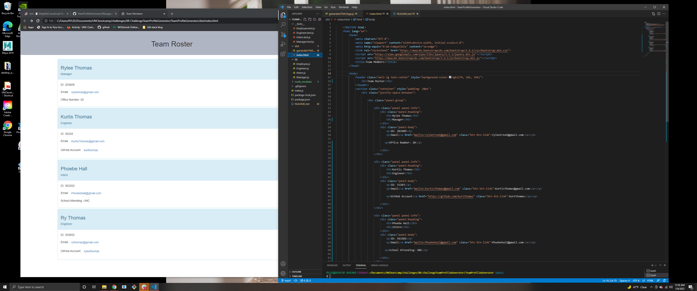

# Team Profile Generator Challenge

  

  ## Description 
  As a manager, I want to generate a webpage that displays my team's basic info so that I have quick access to their information. This is a command-line applicatio that accepts user
  input when prompted. When teammembers information is input, than an HTML file is generated that displays the roster using boostrap. 
  [Link to Demo Webpage](https://ryleethomas.github.io/TeamProfileGenerator/dist/index.html)

  ## Table of Contents 
  * [Installation](#installation)
  * [Usage](#Usage)
  
   * [License](#License)
  
  * [Contributing](#Contributing)
  * [Test](#Test)
  * [Questions](#Questions)
  
  ## Installation 
  First, clone the project files. Second, run npm init to install any dependencies needed. Lastly, run node index and enter your info into prompts.

  ## Usage
  When prompted for information about my application, the information inputed will then generate a webpage that will display each workers relative information.

  
  ## Liscense
  This application is covered under the GNU_AGPLv3.
  For more information regarding the license permissions, conditions, and limitations please
  visit [chooselicense.com](https://choosealicense.com/licenses/)
  

  ## Contributing
  Developers can contribute as needed.

  ## Test
  Testing files are under the folder __tests__, and I am using Jest for testing purposes.
  [Link of Test Walk Through](https://watch.screencastify.com/v/nTrMW77xTfaPr8LK3JSj)
  
  Using the Node.js from the command line.
  [Link to Video Tutorial](https://watch.screencastify.com/v/se8X9zSkTun40yexiZLo)

  ## Questions
  My Github username is RyleeThomas , if you would like to visit my GitHub page the link is: www.github.com/RyleeThomas
  For further quesitons please reach out via email: Ryleetreat@gmail.com
